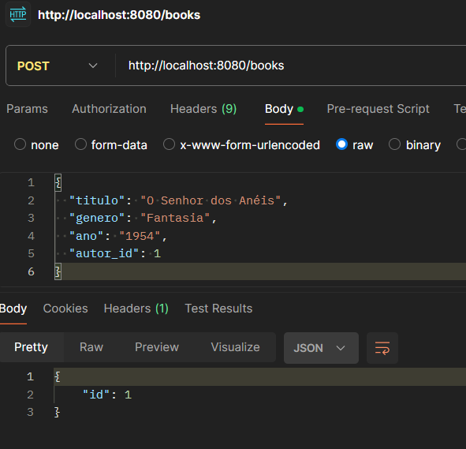
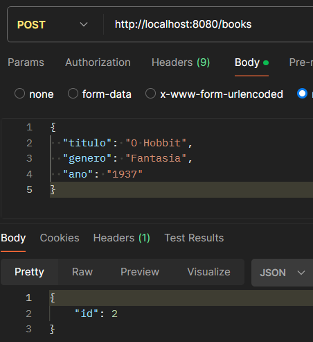
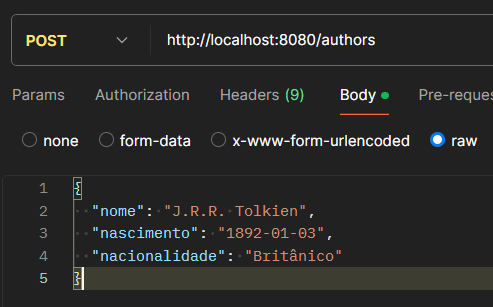
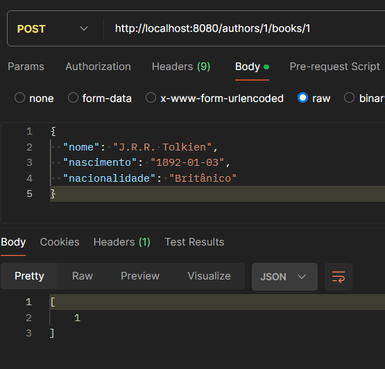
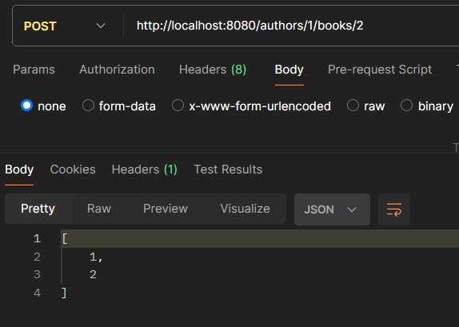
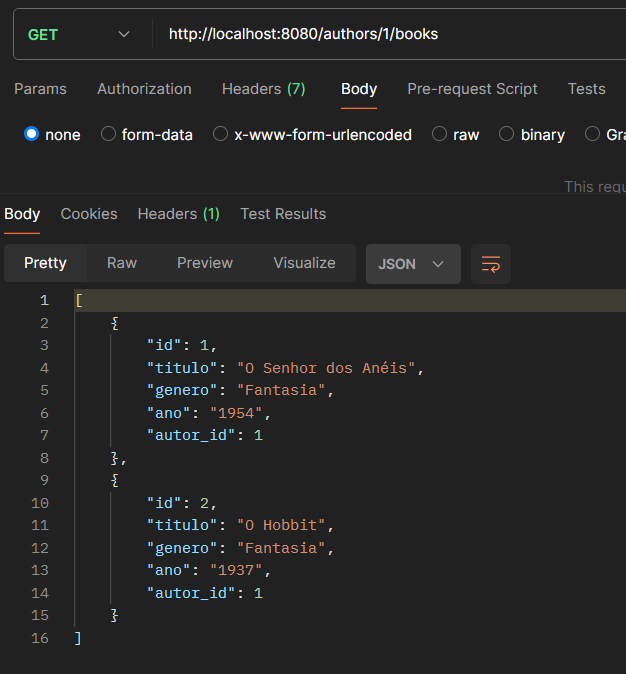

# Projeto Biblioteca - Documentação

## Descrição
Este é um projeto simples que implementa uma API para gerenciar livros e autores de uma biblioteca. A API é capaz de processar requisições HTTP para operações CRUD (Criar, Ler, Atualizar e Excluir) sobre livros e autores, além de permitir a associação de livros a autores. Nossa API foi implementada usando bibliotecas nativas do Python e manipulação de sockets.

## Como rodar o projeto
Para implementar nossa API basta: 
- rodar o arquivo `Main.py` que iniciará usando todas as classes;
- abra uma plataforma de requisição como o Postman;
- colocar o url `http://localhost:8080` e utilizar os paths dos endpoints descritos na seção `5. Servidor API Biblioteca -Roteamentos`.

## Estrutura de Classes

O projeto é composto por quatro classes principais:

### 1. Main
Classe responsável por iniciar o servidor.
- Invoca o método `servidorBiblioteca()` da classe **Biblioteca** para começar a ouvir requisições HTTP.

### 2. Livro
Representa um livro na biblioteca.

#### Atributos:
- `titulo`: título do livro.
- `genero`: gênero do livro (opcional, valor padrão "Geral").
- `ano`: ano de publicação do livro (opcional).
- `autor_id`: ID do autor (opcional).

#### Métodos:
- `to_dict()`: converte o objeto livro para um dicionário, útil para serialização.

### 3. Autor
Representa um autor.

#### Atributos:
- `nome`: nome do autor.
- `nascimento`: data de nascimento do autor.
- `nacionalidade`: nacionalidade do autor.

#### Métodos:
- `to_dict()`: converte o objeto autor para um dicionário.

### 4. Biblioteca
Gerencia a coleção de livros e autores e as associações entre eles.

#### Atributos:
- `livros`: dicionário que armazena livros, com o ID do livro como chave.
- `autores`: dicionário que armazena autores, com o ID do autor como chave.
- `associacoes`: dicionário que associa autores a livros.
- `proximo_id_livro`: ID a ser atribuído ao próximo livro adicionado.
- `proximo_id_autor`: ID a ser atribuído ao próximo autor adicionado.

#### Métodos:
- **adicionarAutor(nome, nascimento='Não disponível', nacionalidade='Não disponível')**
  - Parâmetros: `nome`, `nascimento` (opcional), `nacionalidade` (opcional).
  - Retorno: ID do autor recém-adicionado.

- **listarAutores()**
  - Parâmetros: Nenhum.
  - Retorno: Lista de dicionários contendo os dados dos autores.

- **detalhesAutor(autor_id)**
  - Parâmetros: `autor_id` (ID do autor).
  - Retorno: Dicionário com os detalhes do autor, ou `None` se não encontrado.

- **atualizarAutor(autor_id, nome=None, nascimento=None, nacionalidade=None)**
  - Parâmetros: `autor_id`, `nome` (opcional), `nascimento` (opcional), `nacionalidade` (opcional).
  - Retorno: Dicionário atualizado do autor, ou `None` se o autor não existir.

- **removerAutor(autor_id)**
  - Parâmetros: `autor_id` (ID do autor).
  - Retorno: Autor removido, ou `None` se o autor não for encontrado.

- **adicionarLivro(titulo, genero='Geral', ano=None, autor_id=None)**
  - Parâmetros: `titulo`, `genero` (opcional), `ano` (opcional), `autor_id` (opcional).
  - Retorno: ID do livro recém-adicionado.

- **listarLivros()**
  - Parâmetros: Nenhum.
  - Retorno: Lista de dicionários contendo os dados dos livros.

- **detalhesLivro(livro_id)**
  - Parâmetros: `livro_id` (ID do livro).
  - Retorno: Dicionário com os detalhes do livro, ou `None` se não encontrado.

- **atualizarLivro(livro_id, titulo=None, genero=None, ano=None, autor_id=None)**
  - Parâmetros: `livro_id`, `titulo` (opcional), `genero` (opcional), `ano` (opcional), `autor_id` (opcional).
  - Retorno: Dicionário atualizado do livro, ou `None` se o livro não existir.

- **removerLivro(livro_id)**
  - Parâmetros: `livro_id` (ID do livro).
  - Retorno: Livro removido, ou `None` se o livro não for encontrado.

- **associarLivro(autor_id, livro_id)**
  - Parâmetros: `autor_id`, `livro_id`.
  - Retorno: ID do autor associado ao livro.

- **listarLivrosAutor(autor_id)**
  - Parâmetros: `autor_id` (ID do autor).
  - Retorno: Lista de IDs dos livros associados ao autor, ou `None` se não houver associações.

- **removerAssociacao(autor_id, livro_id)**
  - Parâmetros: `autor_id`, `livro_id`.
  - Retorno: ID do livro desassociado, ou mensagens "Sem autor" ou "Sem livro" se não houver correspondência.

### 5. Servidor API Biblioteca
Este método inicializa o servidor e implementa o roteamento para lidar com as requisições HTTP.

#### Roteamento:
- **/books**
  - `POST`: Adiciona um livro. Requer no corpo da requisição: `titulo`, `genero` (opcional), `ano` (opcional), `autor_id` (opcional). Retorna o ID do livro criado.
  - `GET`: Lista todos os livros. Retorna uma lista de livros no formato JSON.
  
- **/books/{id}**
  - `GET`: Retorna os detalhes de um livro específico.
  - `PUT`: Atualiza um livro existente. Requer no corpo da requisição: `titulo`, `genero`, `ano`, `autor_id` (opcional).
  - `DELETE`: Remove um livro pelo ID.

- **/authors**
  - `POST`: Adiciona um autor. Requer no corpo da requisição: `nome`, `nascimento` (opcional), `nacionalidade` (opcional). Retorna o ID do autor criado.
  - `GET`: Lista todos os autores. Retorna uma lista de autores no formato JSON.

- **/authors/{id}**
  - `GET`: Retorna os detalhes de um autor específico.
  - `PUT`: Atualiza um autor existente. Requer no corpo da requisição: `nome`, `nascimento`, `nacionalidade` (opcional).
  - `DELETE`: Remove um autor pelo ID.

- **/authors/{id}/books**
  - `GET`: Lista todos os livros associados a um autor específico.

- **/authors/{id}/books/{book_id}**
  - `POST`: Associa um livro a um autor.
  - `DELETE`: Desassocia um livro de um autor específico.

#### Detalhes do Servidor:
- O servidor é executado no endereço `http://localhost:8080`.
- Ele usa sockets para escutar requisições e processar os métodos HTTP adequados.
- Suporta os métodos HTTP: `GET`, `POST`, `PUT`, `DELETE`.

A lógica de roteamento distribui as requisições para os métodos correspondentes da classe **Biblioteca**, garantindo que as operações sobre autores e livros sejam manipuladas corretamente.

